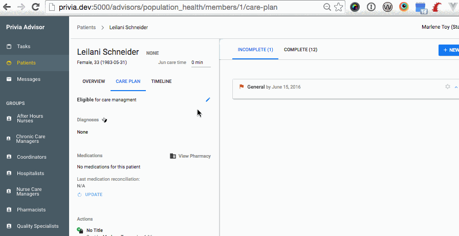
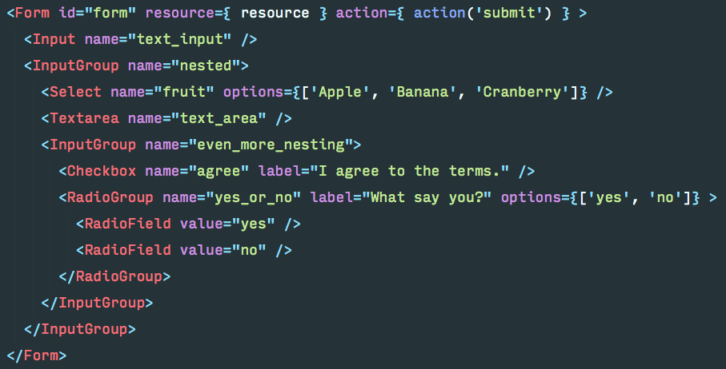
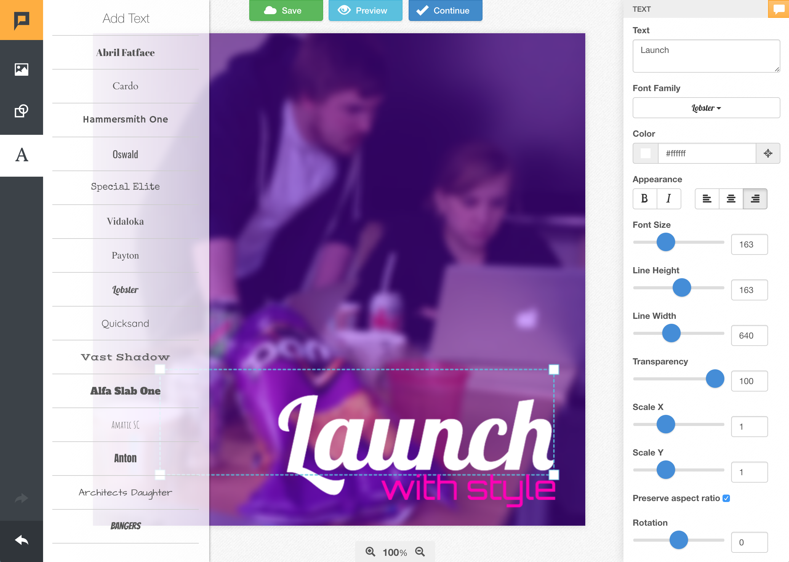
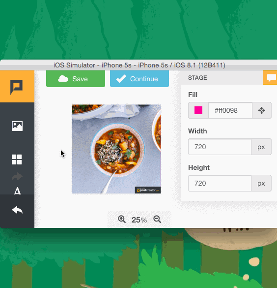
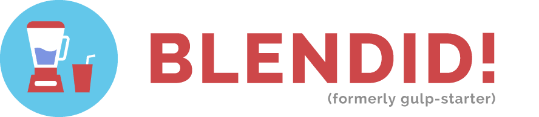
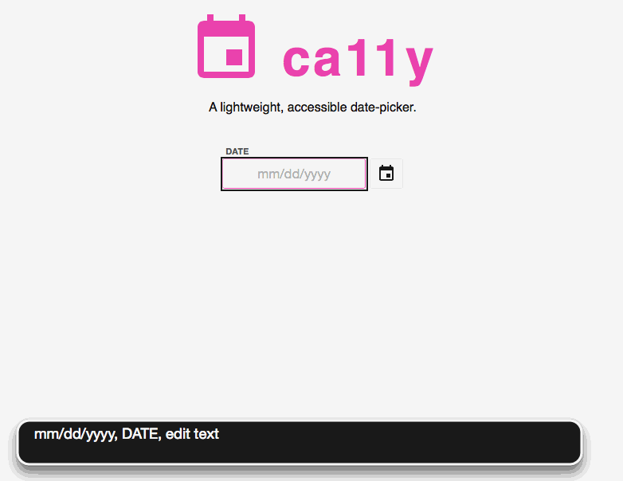

# README

### Dan Tello

**Ex-graphic designer who fell in love with code.** I've been creating for the web since age 12, starting with the premier developer tool of the day: Microsoft Word '97. I've since traded in WordArt and rainbow gradients for a terminal and text editor, but my appreciation for (and undergraduate degree in) graphic design still shine through.

At work, I spend my time building fast and accessible JavaScript applications (React.js ❤), collaborating with visual and UX designers, and tweaking [build tools](https://github.com/vigetlabs/gulp-starter/tree/blendid).

- Github - [@greypants](https://github.com/greypants)
- Twitter - [@dantello5](https://twitter.com/dantello5)
- Instagram - [@suchgreywow](https://www.instagram.com/suchgreywow/)
- LinkedIn - [@greypants](https://www.linkedin.com/in/greypants/)

## Selected Work 🦄

### Avalon
Lead JS/Front-End Developer on a collaborative network graph editing tool for cyber security analysts. I helped take the product from white board concepts to a fully featured product with close collaboration with our the client's back-end developer and members of our UX and Design team. 

React.js + Microcosm.js (flux) app backed by WebSockets a Django REST API. The interactive network graph visualization is built on top of Vis.js.

### Privia Medical Group
Lead JS/Front-End Developer building a new coordinated patient health care management platform for Privia health care management teams. Helped push the development team from a traditional Rails view-based solution towards React.js. Having a unidirectional data flow and a component based system allowed us to build much more complex and elegant user experience, all with a maintainable code base built to scale. 

Forms were a big part of the interface, so I built a robust React component library to allow back-end devs to easily create consistent form layouts with proper styling, error handling, and data submission with minimal markup.

React.js + Microcosm.js (flux) app backed by Rails JSON API 

### Post Creator

Lead JS/Front-End Developer building a social media graphic creation and posting tool that can simultaneously post content to multiple destinations. We took the client's idea from white board to product.

While it didn't start as a mobile-focused product, we did end up adapting it for small screens.

Backbone.js 💀, Create.js, Ruby on Rails

### Run Puma Run
Collaborated with a Designer on an 8-bit style infinite runner game built for Puma.com during the 2012 Summer Olympics. One of my favorite projects of all time :) Featured as a [FWA site of the day](https://thefwa.com/cases/run-puma-run).

JavaScript + canvas — no libraries! Created original sound effects in Garage Band. [Click to play!](code.viget.com/run-puma-run)

## Open Source Projects 

### Blendid

A delicious blend of gulp tasks combined into a configurable asset pipeline and static site builder.

Strings together compiling Webpack 2 (with Babel and hot-module replacement), Node Sass, BrowserSync, SVG Sprite creation, HTML templating (Nunjucks) and other assets together into a single package with minimal configuration. 

<a class="github-button" href="https://github.com/vigetlabs/gulp-starter" data-icon="octicon-star" data-style="mega" data-count-href="/vigetlabs/gulp-starter/stargazers" data-count-api="/repos/vigetlabs/gulp-starter#stargazers_count" data-count-aria-label="# stargazers on GitHub" aria-label="Star vigetlabs/gulp-starter on GitHub">Star</a>

This is Viget's most popular open source project, and used on most of our client work. Grew steadily out of ideas from my [Gulp + Browserify](https://www.viget.com/articles/gulp-browserify-starter-faq) blog post in 2014.

[https://github.com/vigetlabs/gulp-starter/tree/blendid](https://github.com/vigetlabs/gulp-starter/tree/blendid)

### Ca11y

A lightweight, dependency-free, keyboard accessible datepicker with special attention to Apple Voiceover dictation.

[https://github.com/vigetlabs/ca11y
](https://github.com/vigetlabs/ca11y)

### inline-svg-sprite
Inlines external svgs sprites and updates `xlink:href` attributes in `<use>` tags to reference the inlined svg. Created when some shortcomings of [svg4Everybody](https://github.com/jonathantneal/svg4everybody) surfaced on a project. 

Primarily for Internet Explorer compatibility with external SVG sprites.

[https://github.com/vigetlabs/inline-svg-sprite](https://github.com/vigetlabs/inline-svg-sprite)

## Writing ✏️

### Viget.com
Without blog posts, stack overflow, and Google, I wouldn't be the developer I am today. I have learned so much because others took the time to publish what they've learned to a url. When time permits, I try to give back and add to the collective knowledge from which I built a career.

⭐️ [Native or Not? The Untapped Power of Web Apps](https://www.viget.com/articles/native-or-not-the-untapped-power-of-web-apps)

⭐️ [Gulp on Rails: Replacing the Asset Pipeline](https://www.viget.com/articles/gulp-rails-asset-pipeline)

⭐️ [Gulp + Browserify: The Everything Post](https://www.viget.com/articles/gulp-browserify-starter-faq)

⭐️ [Sassier (BE)Modifers](https://www.viget.com/articles/bem-sass-modifiers)

##### More

- [The HTML Base Tag](https://www.viget.com/articles/html-base-tag)
- [Single-click layer exporting in Photoshop](https://www.viget.com/articles/single-click-layer-exporting-in-photoshop)
- [Time-based Animation with HTML 5 Canvas and JavaScript](https://www.viget.com/articles/time-based-animation)
- [A Better Way to Add a ‘selected’ Class to Links in Rails](https://www.viget.com/articles/rails-selected-nav-link-helper)
- [CSS pointer-events and a pure CSS3 animating tooltip](https://www.viget.com/articles/css-pointer-events-and-a-pure-css3-animating-tooltip)
- [SXSW Recap (2 of 4): Inspired](https://www.viget.com/articles/sxsw-recap-2-of-4-inspired)
- [-webkit-transform: kill-the-flash](https://www.viget.com/articles/webkit-transform-kill-the-flash)
- [Internet Explorer, Transparent PNGs, and jQuery Animation: The Black Background Issue Solved](https://www.viget.com/articles/jquery-ie-png-24-ie-black-background-issue-solved)

### net magazine
- **Issue 282** _"Voice of the Web - Design Gallery"_ August 2016
- **Issue 262** _"Desktop Last: What are we so afraid of?"_ January 2015  Re-published online as _["How to get your clients excited about mobile-first"](http://www.creativebloq.com/web-design/how-get-your-clients-excited-about-mobile-first-101517507)_
- **Issue 244** _["The Paint Drop: a masterclass in responsive design"](http://www.creativebloq.com/web-design/paint-drop-8134189)_ July 2014 (mention/interview)

## Speaking 💬

I love attending conferences to listen to the experiences of others in our industry. I also love sharing knowledge back with the community I've gained so much from. I've been speaking at conferences and meetups regularly since 2013. [View my SpeakerRate profile.](https://speakerrate.com/speakers/17504-dan-tello)

### Microcosm.js: An evolution of Flux

An overview of the action-centered Flux implementation Viget uses on all of our React apps.

[View Slides](http://slides.com/dantello/microcosm-js)

#### Events

- [React Nova January 2017](https://www.meetup.com/React-NOVA/events/236123537/)

### Native or Not? The untapped power of web apps

Highlights all of the sometimes overlooked capabilities and benefits of the browser on your phone, as well as scenarios where web might better fit than native.

[View Slides](http://slides.com/dantello/native-or-not-3-4)

#### Events 

- [BD Conf Washington DC 2015](http://bdconf.com/events/ashington-dc/)
- [BD Conf Nashville 2015](http://bdconf.com/events/nashville/)
- [Forge Conf 2015](http://2015.forgeconf.com/)

### Desktop Last: What are we so afraid of?
A plea for mobile focused project pitching, planning, design, and execution, and an argument that ALL experiences, large and small will profit.

[View Slides](http://slides.com/dantello/desktop-last)

#### Events 

- [Giant Conf 2014](http://2014.giantconf.com/) 

### Game Development with JavaScript and Canvas

Intro to building a game with JavaScript and the HTML Canvas element with a peek under the hood at building Run Puma Run.

[View Slides](http://greypants.github.io/html5-games-talk)

#### Events

- [Converge SE 2014](http://convergese.com/2014/speakers.php#dan-tello)
- [Converge RVA 2013](https://www.flickr.com/photos/petridisc/sets/72157636544436635/)
- [Front End Design Conf 2013](http://frontenddesignconference.com/2013.html) (attendee track)

<!-- Place this tag in your head or just before your close body tag. -->

